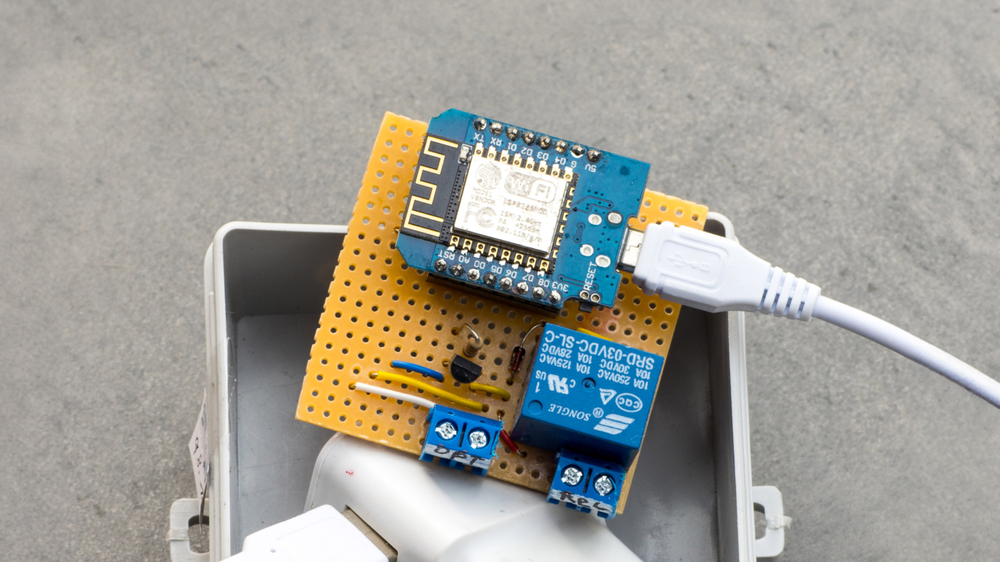

Maker Media GmbH

***

# Automatisiert Strom sparen

### Als Tibber-Nutzer sparen Sie mit diesem selbst gebauten Tibber-Relais Zeit und Energie. Es steuert große Geräte automatisch und findet den günstigsten Zeitpunkt dafür.

Ergänzend zum Artikel in der Make 5/24 finden Sie hier die Arduino-Sketches für das Tibber-Relais.

Den vollständigen Artikel kann man in der **[Make-Ausgabe 5/24](https://www.heise.de/select/make/2024/5)** lesen.
